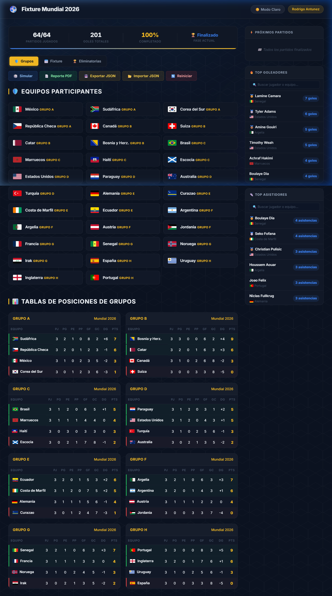

# ⚽ Fixture del Mundial 2026 — Real-Time Tracker

Un **Fixture Interactivo en Tiempo Real** para la Copa del Mundial de Fútbol 2026. Esta aplicación es una Single Page Application (SPA) premium de alto rendimiento diseñada para gestionar todo el transcurso del torneo, desde la fase de grupos hasta la gran final.

---

<p align="center">
  
</p>

---

## 🛠️ Stack Tecnológico

A continuación se detallan las tecnologías clave utilizadas para construir este proyecto de forma limpia y moderna, sin dependencias pesadas:


---

## ✨ Características Principales

* 🏃‍♂️ **Lista de Equipos**: Vista interactiva de las 32 selecciones organizadas en una grilla premium con banderas reales.
* 📊 **Fase de Grupos Dinámica**: Tablas de posiciones interactivas que recalculan instantáneamente los puntos, diferencia de gol, goles a favor y aplican de forma estricta los criterios oficiales de desempate de la FIFA.
* 🏆 **Bracket de Fase Eliminatoria (Playoffs)**: Árbol interactivo que conecta desde octavos de final hasta la gran final (y tercer puesto), propagando ganadores automáticamente.
* ✍️ **Fixture Interactivo con Penales**: Carga rápida de marcadores con soporte de penales en caso de empates en fases eliminatorias.
* 👟 **Estadísticas de Goleadores y Asistidores**: Actualización instantánea en la barra lateral conforme se registran los eventos en cada partido.
* 🌐 **Conversión Automática de Zona Horaria**: Los partidos se configuran en formato UTC y la aplicación los convierte dinámicamente a la zona horaria del usuario local.
* 💾 **Persistencia con LocalStorage**: Todo el progreso del mundial y los datos ingresados se guardan de forma persistente en tu navegador.
* 🎨 **Diseño Premium**: Interfaz oscura deportiva tipo dashboard con diseño totalmente responsivo y animaciones sutiles.

---

## ⚙️ Guía de Ejecución Rápida (Windows)

### Opción 1: Ejecución Automática (Doble Clic)
1. Descarga o clona el repositorio.
2. Ve a la carpeta del proyecto.
3. Haz doble clic en el archivo **`iniciar.bat`**.
   * *Este script automatizado instalará las dependencias necesarias (`npm install`), iniciará el servidor de desarrollo en la terminal y abrirá la aplicación en tu navegador web.*

### Opción 2: Ejecución Manual en Terminal
Si prefieres correrlo tú mismo desde una consola:
1. Abre tu terminal en la carpeta del proyecto.
2. Instala las dependencias:
   ```bash
   npm install
   ```
3. Inicia el servidor de desarrollo con Vite:
   ```bash
   npm run dev
   ```
4. Abre [http://localhost:5173/](http://localhost:5173/) en tu navegador.

---

## 🧠 Decisiones de Diseño y Arquitectura

1. **Arquitectura Limpia (Separación de Responsabilidades)**:
   * 📁 `src/data/`: Datos estáticos iniciales de equipos y partidos del Mundial 2026.
   * 📁 `src/logic/`: Funciones puras para el cálculo de posiciones de grupos, desempates FIFA y propagación de eliminatorias.
   * 📁 `src/ui/`: Módulos modulares de renderizado reactivo del DOM.
   * 📄 `src/main.js`: Controlador principal (orquestador) del flujo de datos, persistencia en storage y eventos.

2. **Propagación en Cascada Segura**:
   Al modificar el resultado de un partido de fase de grupos que altere los clasificados a playoffs, el fixture recalcula dinámicamente a los rivales y limpia de forma segura cualquier marcador futuro para prevenir inconsistencias lógicas en el bracket.

3. **Optimización de Entrada de Datos**:
   Al cargar un goleador o asistente, el sistema filtra y autocompleta con una lista de sugerencias dinámicas (`<datalist>`) limitada únicamente a los jugadores de las dos selecciones que se están enfrentando.

